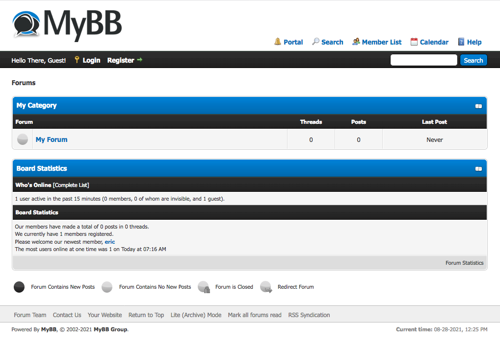

<!--
N.B.: This README was automatically generated by https://github.com/YunoHost/apps/tree/master/tools/README-generator
It shall NOT be edited by hand.
-->

# MyBB for YunoHost

[](https://dash.yunohost.org/appci/app/mybb)    
[](https://install-app.yunohost.org/?app=mybb)

*[Lire ce readme en français.](./README_fr.md)*

> *This package allows you to install MyBB quickly and simply on a YunoHost server.
If you don't have YunoHost, please consult [the guide](https://yunohost.org/#/install) to learn how to install it.*

## Overview

MyBB is the free and open source forum software powering thousands of engaging, vibrant, and unique communities across the internet.

**Shipped version:** 1.8.30~ynh1


**Demo:** https://demomybb.tk/

## Screenshots



## Disclaimers / important information

* How to post-install:
    * The database credentials are send to the admin be email.

* How to upgrade:
	* Remove the lock file `sudo rm /var/www/mybb/install/lock`
    * and follow the post install `https://www.domain.ltd/mybb/install/upgrade.php`

## Documentation and resources

* Official app website: <https://mybb.com/>
* Official admin documentation: <https://docs.mybb.com/1.8/administration/>
* Upstream app code repository: <https://github.com/mybb/mybb>
* YunoHost documentation for this app: <https://yunohost.org/app_mybb>
* Report a bug: <https://github.com/YunoHost-Apps/mybb_ynh/issues>

## Developer info

Please send your pull request to the [testing branch](https://github.com/YunoHost-Apps/mybb_ynh/tree/testing).

To try the testing branch, please proceed like that.

``` bash
sudo yunohost app install https://github.com/YunoHost-Apps/mybb_ynh/tree/testing --debug
or
sudo yunohost app upgrade mybb -u https://github.com/YunoHost-Apps/mybb_ynh/tree/testing --debug
```

**More info regarding app packaging:** <https://yunohost.org/packaging_apps>
