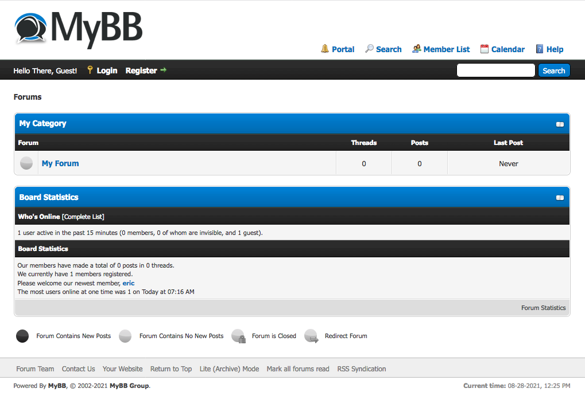

<!--
NOTA: Este README foi creado automáticamente por <https://github.com/YunoHost/apps/tree/master/tools/readme_generator>
NON debe editarse manualmente.
-->

# MyBB para YunoHost

[](https://dash.yunohost.org/appci/app/mybb)  

[](https://install-app.yunohost.org/?app=mybb)

*[Le este README en outros idiomas.](./ALL_README.md)*

> *Este paquete permíteche instalar MyBB de xeito rápido e doado nun servidor YunoHost.*  
> *Se non usas YunoHost, le a [documentación](https://yunohost.org/install) para saber como instalalo.*

## Vista xeral

MyBB is the free and open source forum software powering thousands of engaging, vibrant, and unique communities across the internet.

**Versión proporcionada:** 1.8.31~ynh1

**Demo:** <https://demomybb.tk/>

## Capturas de pantalla



## Documentación e recursos

- Web oficial da app: <https://mybb.com/>
- Documentación oficial para admin: <https://docs.mybb.com/1.8/administration/>
- Repositorio de orixe do código: <https://github.com/mybb/mybb>
- Tenda YunoHost: <https://apps.yunohost.org/app/mybb>
- Informar dun problema: <https://github.com/YunoHost-Apps/mybb_ynh/issues>

## Info de desenvolvemento

Envía a túa colaboración á [rama `testing`](https://github.com/YunoHost-Apps/mybb_ynh/tree/testing).

Para probar a rama `testing`, procede deste xeito:

```bash
sudo yunohost app install https://github.com/YunoHost-Apps/mybb_ynh/tree/testing --debug
ou
sudo yunohost app upgrade mybb -u https://github.com/YunoHost-Apps/mybb_ynh/tree/testing --debug
```

**Máis info sobre o empaquetado da app:** <https://yunohost.org/packaging_apps>
